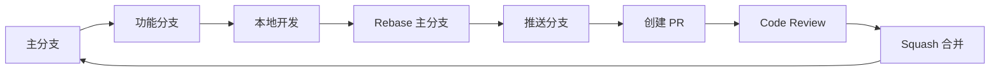

# Git 线性提交历史最佳实践

## 基本原则

1. 使用 rebase 而不是 merge
2. 避免直接在主分支提交
3. 提交前先更新本地分支

## 具体实践

### 1. 使用 rebase 工作流

```bash
# 在功能分支开发
git checkout -b feature

# 提交修改
git add .
git commit -m "feat: add new feature"

# 在提交PR前先rebase主分支
git fetch origin main
git rebase origin/main

# 如有冲突则解决后继续
git add .
git rebase --continue
```

### 2. 配置 pull 策略

```bash
# 全局配置
git config --global pull.rebase true

# 或者仓库配置
git config pull.rebase true

# 拉取远程变更时会自动rebase
git pull
```

### 3. 使用 Squash 合并

```bash
# 在 GitHub/GitLab 上将 PR 设置为 Squash merge
# 或者手动 squash
git checkout main
git merge --squash feature
git commit -m "feat: add feature xyz"
```

### 4. 保护主分支

```bash
# 在 GitHub/GitLab 设置分支保护规则:
1. 禁止直接推送到主分支
2. 要求 PR 审查
3. 要求最新的主分支提交
4. 启用自动 CI 检查
```

## 团队协作规范

1. **分支命名规范**

```bash
feature/xxx  # 新功能
fix/xxx      # 修复bug
docs/xxx     # 文档更新
refactor/xxx # 重构
```

2. **提交信息规范**

```bash
# Angular 规范
feat: 添加新功能
fix: 修复问题
docs: 修改文档
style: 代码格式修改
refactor: 重构代码
test: 添加测试
chore: 修改构建过程或辅助工具
```

3. **工作流程**



## 常见问题处理

### 1. 解决 rebase 冲突

```bash
# 当 rebase 出现冲突时
git rebase main
# 解决冲突文件
git add .
git rebase --continue
# 如果想取消 rebase
git rebase --abort
```

### 2. 修改最近的提交

```bash
# 修改最后一次提交
git commit --amend

# 修改最后几次提交
git rebase -i HEAD~3
```

### 3. 清理本地分支

```bash
# 删除已合并的本地分支
git branch --merged | grep -v "\*" | xargs -n 1 git branch -d

# 清理远程不存在的本地分支
git fetch -p
git branch -vv | grep ': gone]' | awk '{print $1}' | xargs git branch -D
```

## 工具支持

1. **Git Hooks**

```bash
# pre-commit hook 示例
#!/bin/sh
BRANCH=`git rev-parse --abbrev-ref HEAD`

if [[ "$BRANCH" == "main" ]]; then
  echo "不能直接在 main 分支提交"
  exit 1
fi
```

2. **CI/CD 配置**

```yaml
# .github/workflows/pr.yml
name: PR Check
on: [pull_request]
jobs:
  check:
    runs-on: ubuntu-latest
    steps:
      - uses: actions/checkout@v2
      - name: Check branch is up to date
        run: |
          git fetch origin main
          git merge-base --is-ancestor origin/main HEAD
```

## 最佳实践总结

1. 始终从最新的主分支创建功能分支
2. 经常性地 rebase 主分支保持同步
3. 提交前进行代码自审
4. 遵循提交信息规范
5. 使用工具强制执行规范
6. 及时清理过期分支
