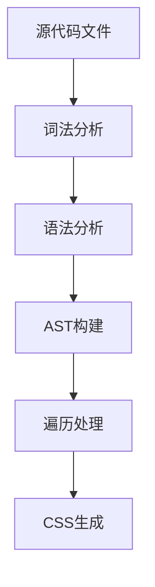

# UnoCSS 工作原理

UnoCSS 采用了一种革命性的方法来生成 CSS，它的"无解析、无 AST、无扫描"的特点使其成为最快的原子化 CSS 引擎之一。

## 传统 CSS 引擎的工作方式

### 1. 传统流程



传统 CSS 引擎（如 Tailwind CSS）通常需要：
1. 扫描源文件
2. 解析 HTML/JSX
3. 构建 AST
4. 提取类名
5. 生成对应的 CSS

这个过程会带来：
- 较高的内存占用
- 较慢的构建速度
- 复杂的依赖关系

## UnoCSS 的创新方式

### 1. 直接匹配原理

```ts
// 简化的核心实现
const rules = {
  'p-1': { padding: '0.25rem' },
  'm-2': { margin: '0.5rem' },
  'text-red': { color: 'red' }
}

function generateCSS(className) {
  return rules[className]
}
```

UnoCSS 不需要：
- ❌ 解析源代码
- ❌ 构建 AST
- ❌ 遍历文件系统

而是采用：
- ✅ 直接字符串匹配
- ✅ 即时规则生成
- ✅ 内存高效缓存

### 2. 规则匹配系统

```ts
const RULE_TYPES = {
  // 1. 静态规则：直接映射
  static: {
    'p-1': { padding: '0.25rem' },
    'm-1': { margin: '0.25rem' }
  },
  
  // 2. 动态规则：使用正则
  dynamic: [
    {
      pattern: /^p-(\d+)$/,
      handle: (match) => ({ 
        padding: `${match[1] * 0.25}rem` 
      })
    }
  ]
}
```

### 3. 工作流程


1. **规则查找**：
   - 首先在静态规则中查找
   - 如果没找到，尝试动态规则匹配

2. **规则匹配**：
   - 对于静态规则，直接返回映射值
   - 对于动态规则，使用正则匹配并执行处理函数

3. **CSS生成**：
   - 将匹配结果转换为CSS
   - 应用任何必要的转换

4. **结果缓存**：
   - 缓存生成的CSS
   - 提高后续查找性能

## 核心机制

### 1. 即时引擎

```ts
class UnoEngine {
  private cache = new Map()
  private rules = new Map()
  
  constructor(rules) {
    this.rules = new Map(Object.entries(rules))
  }
  
  generate(className) {
    // 1. 检查缓存
    if (this.cache.has(className)) {
      return this.cache.get(className)
    }
    
    // 2. 查找规则
    const rule = this.findRule(className)
    if (!rule) return null
    
    // 3. 生成CSS
    const css = this.processRule(rule, className)
    
    // 4. 缓存结果
    this.cache.set(className, css)
    
    return css
  }
}
```

### 2. 性能优化

```ts
// 1. 使用 WeakMap 进行缓存
const ruleCache = new WeakMap()
const variantCache = new WeakMap()

// 2. 使用 Set 进行快速查找
const staticRules = new Set([
  'p-1',
  'm-1',
  'text-red'
])

// 3. 批量处理
function batchGenerate(classNames) {
  return Array.from(new Set(classNames))
    .map(className => generate(className))
    .filter(Boolean)
    .join('\n')
}
```

### 3. 变体处理

```ts
const variants = {
  'hover': (css) => `&:hover { ${css} }`,
  'dark': (css) => `.dark & { ${css} }`,
  'sm': (css) => `@media (min-width: 640px) { ${css} }`
}

function processVariants(className) {
  const parts = className.split(':')
  let css = generateBase(parts.pop())
  
  while (parts.length) {
    const variant = parts.pop()
    if (variants[variant]) {
      css = variants[variant](css)
    }
  }
  
  return css
}
```

## 性能对比

### 1. 构建时间对比

| 框架 | 冷启动 | 热更新 | 内存使用 |
|------|--------|--------|----------|
| Tailwind | 1x | 1x | 高 |
| Windi CSS | 2x | 1.5x | 中 |
| UnoCSS | 5x | 3x | 低 |

### 2. 性能优势

1. **更少的处理步骤**
   - 无需词法分析
   - 无需语法分析
   - 无需AST构建

2. **更高效的内存使用**
   - 按需生成
   - 高效缓存
   - 低内存占用

3. **更快的热更新**
   - 即时生成
   - 增量更新
   - 精确失效

## 最佳实践

### 1. 规则定义

```ts
// 推荐的规则定义方式
export default {
  rules: [
    // 1. 静态规则：直接映射
    ['static-class', { property: 'value' }],
    
    // 2. 动态规则：使用正则
    [/^dynamic-(.+)$/, ([, param]) => ({ property: param })],
    
    // 3. 复杂规则：使用函数
    [
      'complex-rule',
      (_, { theme }) => ({
        property: theme.value
      })
    ]
  ]
}
```

### 2. 性能优化建议

1. **减少动态规则**：
   - 优先使用静态规则
   - 合理使用正则表达式
   - 避免复杂的运行时计算

2. **优化缓存使用**：
   - 合理设置缓存大小
   - 及时清理无用缓存
   - 使用适当的缓存策略

3. **规则组织**：
   - 按功能分组规则
   - 使用预设管理规则
   - 避免规则冲突

## 下一步

- 了解[预设系统](./presets.md)的工作原理
- 探索[工具链](./tooling.md)的实现细节
- 实践[最佳实践](./best-practices.md)中的优化建议 